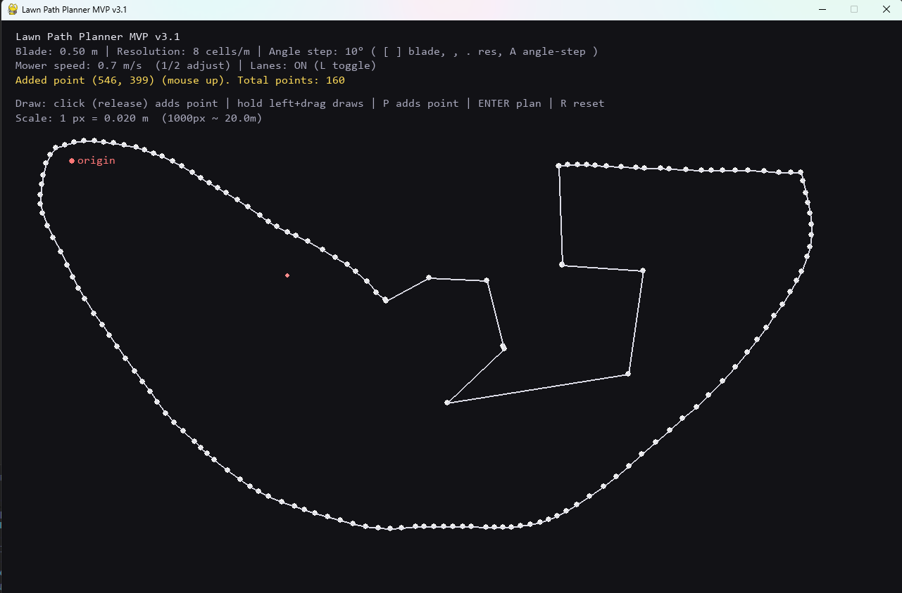
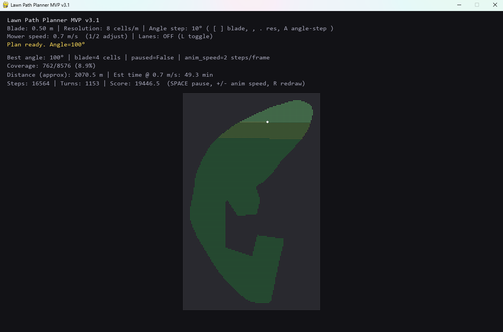

# Lawn Path Planner (MVP)

An interactive Python prototype that computes and visualises an efficient mowing path for an arbitrary lawn shape, given mower blade width and basic constraints.

This project explores **coverage path planning (CPP)** applied to residential lawn mowing (boustrophedon sweeping).

---

## Features

- Draw an arbitrary lawn boundary interactively
- Optional obstacle polygons (“holes”) and selectable start point
- Set mower blade width, planning resolution, and sweep angle step
- Automatically selects an efficient sweep orientation
- Visualises traversal path, coverage progress, and optional mowing lanes (planned stripes)
- Estimates mowing distance and multiple time estimates (base vs turn/overlap-adjusted)
- Ranks mower categories (push, self-propelled, battery, robotic, ride-on) with transparent rationale
- Runs fully locally (no GPS, no cloud)

---

## Screenshots

**Drawing the lawn shape**



**Planned path, obstacles, and time metrics**



---

## How it works

1. Draw a lawn polygon (and optional obstacle polygons)
2. Rasterise the geometry to a grid
3. Evaluate multiple sweep angles
4. Score each candidate by:
   - Path length
   - Turn count (penalised)
5. Render the best plan and compute metrics

---

## Requirements

- Python 3.10+
- pygame
- numpy

---

## Install

```

pip install pygame numpy

```

---

## Run

```

python lawn_carer3.1.py

```

---

## Controls

### Modes (drawing inputs)
- **B:** boundary draw mode
- **O:** obstacle draw mode (adds “holes” inside lawn)
- **S:** start-point mode (click to set start)
- **ENTER:** finalise current polygon / run planning
- **BACKSPACE:** undo last point
- **R:** reset and redraw
- **ESC:** quit

### Drawing
- **Left click (release):** add point  
- **Hold left mouse + drag:** draw shape quickly  
- **P:** add point at cursor  

### Planning / playback
- **SPACE:** pause / resume animation
- **+ / -:** change animation speed
- **T:** toggle turn penalties (compare base vs turn-adjusted time)
- **L:** toggle lane visualisation (**OFF by default**)
- **M:** toggle mower recommendation panel
- **F1–F5 (after planning):** cycle recommendation prefs (budget, effort, noise, storage, terrain)

### Parameters
- **[ / ]:** decrease / increase blade width (m)
- **, / .:** decrease / increase grid resolution
- **A:** cycle sweep angle resolution
- **1 / 2:** decrease / increase mower speed (m/s)

---

## Output metrics

- Coverage percentage
- Approximate total travel distance (meters)
- Base mowing time (distance ÷ mower speed)
- Turn count and turn density (incl. U-turns if shown)
- Turn-adjusted and overlap-adjusted “decision time” (used for recommendations)
- Mower recommendation with top reasons and warnings

Turn penalties are included in the decision time; toggle **T** in the app to compare.

---

## Limitations (current MVP)

- Flat terrain only
- Obstacle handling is basic (polygon holes only)
- Turn and overlap costs are simple heuristics
- Grid approximation (not continuous geometry)

---

## Status

Experimental MVP for exploration and prototyping.
